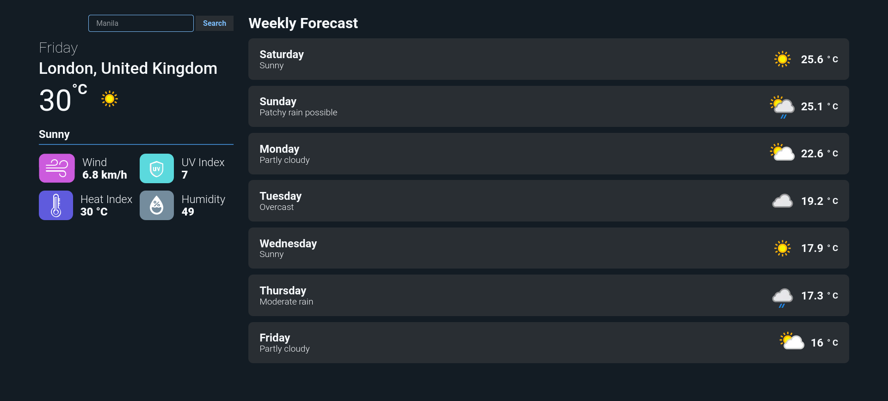
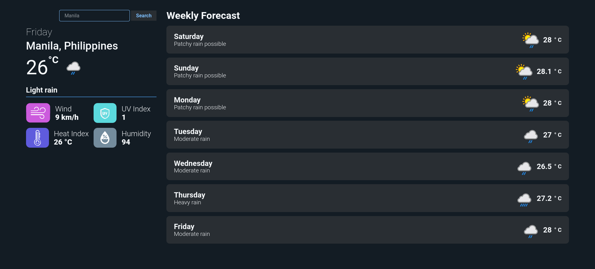
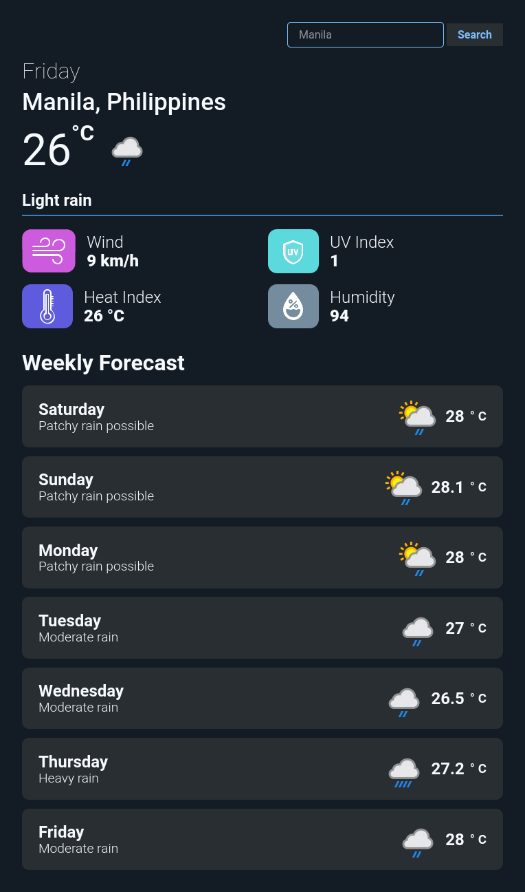

# Weather Man

Another staple project for every aspiring developer, A Weather Application.

'Weather Man' consumes API from **[Weather API](https://www.weatherapi.com/)** and gives it back! Of course, You can also search for countries. 

[Live Demo](https://heyitslauu.github.io/weatherman/) |
[Git Repo](hhttps://github.com/heyitslauu/weatherman)

### **Key Takeaways**
- Fetch
- Async/Await
- Loading/Spinners